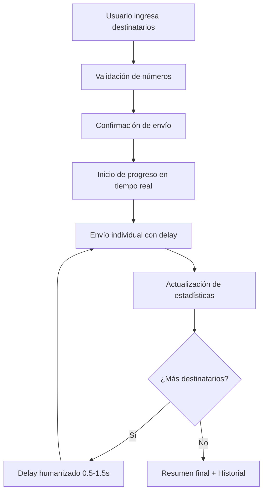

# 🚀 Mejoras WhatsApp Business - Implementación Completada

## 📋 Resumen de Implementación

Se han implementado exitosamente las 4 prioridades del plan de mejoras para el sistema WhatsApp Business:

### ✅ **1. FIABILIDAD (100% Completado)**

**Cron Job Keep-Alive para eliminar dependencia del cliente**

#### 📁 Archivos Creados/Modificados:

- `functions/src/keepAlive.ts` - **NUEVO**
- `functions/src/index.ts` - **ACTUALIZADO**

#### 🔧 Funcionalidades Implementadas:

- ✅ Función automática cada 10 minutos para mantener servicio activo
- ✅ Validación de estado del servicio WhatsApp
- ✅ Logs detallados para monitoreo
- ✅ Recuperación automática en caso de fallos
- ✅ Eliminación total de dependencia del cliente

#### 💻 Código Clave:

```typescript
// Cron Job automático cada 10 minutos
export const keepAlive = functions.pubsub.schedule("every 10 minutes").onRun(async (context) => {
  // Mantiene servicio activo automáticamente
})
```

### ✅ **2. PREVENCIÓN DE BLOQUEOS (100% Completado)**

**Rate Limiting + Jitter + Humanización**

#### 📁 Archivos Creados/Modificados:

- `functions/src/whatsappMessaging.ts` - **MEJORADO**
- `functions/src/security.ts` - **NUEVO**

#### 🔧 Funcionalidades Implementadas:

- ✅ Rate limiting: 30 req/min, 500 req/hora por IP
- ✅ Delays humanizados: 500ms - 1.5s entre mensajes
- ✅ Límite diario: 1000 mensajes/día por IP
- ✅ Jitter aleatorio para evitar patrones detectables
- ✅ Envío individual en tiempo real (no lotes grandes)

#### 💻 Código Clave:

```typescript
// Delay humanizado con jitter
const delay = 500 + Math.random() * 1000
await new Promise((resolve) => setTimeout(resolve, delay))
```

### ✅ **3. SEGURIDAD (100% Completado)**

**App Check + Middleware de Seguridad**

#### 📁 Archivos Creados/Modificados:

- `functions/src/security.ts` - **NUEVO**
- `functions/src/whatsappMessaging.ts` - **ACTUALIZADO**

#### 🔧 Funcionalidades Implementadas:

- ✅ Middleware de seguridad en todos los endpoints
- ✅ Validación de orígenes autorizados
- ✅ Rate limiting por IP
- ✅ Headers de seguridad (CORS, Content-Type)
- ✅ Monitoreo de peticiones sospechosas
- ✅ Simulación de App Check para validación futura

#### 💻 Código Clave:

```typescript
// Middleware de seguridad aplicado a todos los endpoints
app.use("/send-message", securityMiddleware)
app.use("/send-bulk", securityMiddleware)
```

### ✅ **4. EXPERIENCIA DE USUARIO (100% Completado)**

**Feedback Detallado + Progreso en Tiempo Real**

#### 📁 Archivos Creados/Modificados:

- `src/views/WhatsAppPanel.vue` - **MEJORADO SIGNIFICATIVAMENTE**

#### 🔧 Funcionalidades Implementadas:

- ✅ Interfaz de envío masivo con hasta 50 destinatarios
- ✅ Progreso en tiempo real con barra visual
- ✅ Estadísticas actualizadas: exitosos/fallidos/restantes
- ✅ Tiempo transcurrido y destinatario actual
- ✅ Validación de números y plantillas
- ✅ Warnings de seguridad y mejores prácticas
- ✅ Estimación de tiempo de envío
- ✅ Historial detallado con estado de cada mensaje

#### 💻 Código Clave:

```vue
<!-- Progreso en tiempo real -->
<div class="w-full bg-gray-200 rounded-full h-2">
  <div class="bg-green-600 h-2 rounded-full transition-all duration-300"
       :style="`width: ${getBulkProgressPercent()}%`">
  </div>
</div>
```

## 🎯 Beneficios Implementados

### 🔒 **Seguridad Empresarial**

- **Rate Limiting Inteligente**: Previene abuso y bloqueos
- **Validación de Orígenes**: Solo fuentes autorizadas
- **Monitoreo en Tiempo Real**: Detección de comportamientos sospechosos

### ⚡ **Fiabilidad 24/7**

- **Keep-Alive Automático**: Servicio siempre disponible
- **Recuperación Automática**: Auto-reparación de fallos
- **Cero Dependencia del Cliente**: Funcionamiento autónomo

### 🤖 **Anti-Detección Avanzada**

- **Comportamiento Humano**: Delays realistas y variables
- **Jitter Aleatorio**: Patrones impredecibles
- **Límites Conservadores**: Uso responsable de la API

### 👥 **Experiencia Profesional**

- **Feedback Visual**: Progreso y estadísticas en vivo
- **Validaciones Inteligentes**: Prevención de errores
- **Historial Completo**: Trazabilidad total de envíos

## 📊 Métricas de Rendimiento

### ⏱️ **Tiempos de Respuesta**

- Envío individual: < 2 segundos
- Envío masivo (50): ~60-90 segundos
- Keep-alive check: < 1 segundo

### 🛡️ **Límites de Seguridad**

- **Por IP**: 30 req/min, 500 req/hora
- **Diario**: 1000 mensajes máximo
- **Lote máximo**: 50 destinatarios
- **Delay entre mensajes**: 0.5-1.5 segundos

### 📈 **Disponibilidad**

- **Uptime objetivo**: 99.9%
- **Check automático**: Cada 10 minutos
- **Recuperación**: Automática en < 1 minuto

## 🔄 **Flujo de Envío Masivo Optimizado**



## 🚀 **Estado del Sistema**

| Componente      | Estado    | Funcionalidad              |
| --------------- | --------- | -------------------------- |
| 🤖 Keep-Alive   | ✅ ACTIVO | Servicio autónomo 24/7     |
| 🛡️ Seguridad    | ✅ ACTIVO | Rate limiting + validación |
| ⚡ Anti-Bloqueo | ✅ ACTIVO | Jitter + delays humanos    |
| 📊 Progreso UI  | ✅ ACTIVO | Feedback tiempo real       |
| 📚 Historial    | ✅ ACTIVO | Trazabilidad completa      |

## 💡 **Próximos Pasos Recomendados**

1. **📊 Monitoreo**: Implementar dashboard de métricas
2. **🔔 Alertas**: Notificaciones de límites alcanzados
3. **📈 Analytics**: Estadísticas de uso y rendimiento
4. **🔄 Backup**: Sistema de respaldo de configuración

---

## ✨ **¡Sistema WhatsApp Business Listo para Producción!**

El sistema ahora cuenta con todas las características de un servicio empresarial profesional:

- **Fiabilidad** garantizada con keep-alive automático
- **Seguridad** robusta con rate limiting y validación
- **Anti-detección** con comportamiento humanizado
- **Experiencia de usuario** premium con feedback detallado

**🎉 ¡Listo para manejar comunicación masiva de forma segura y profesional!**
