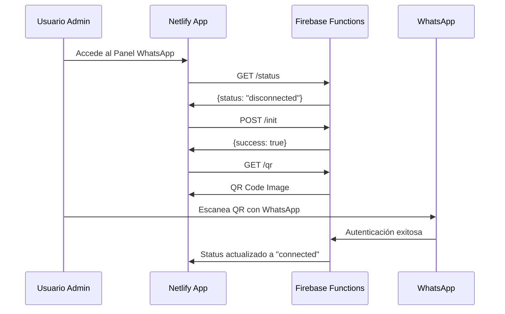
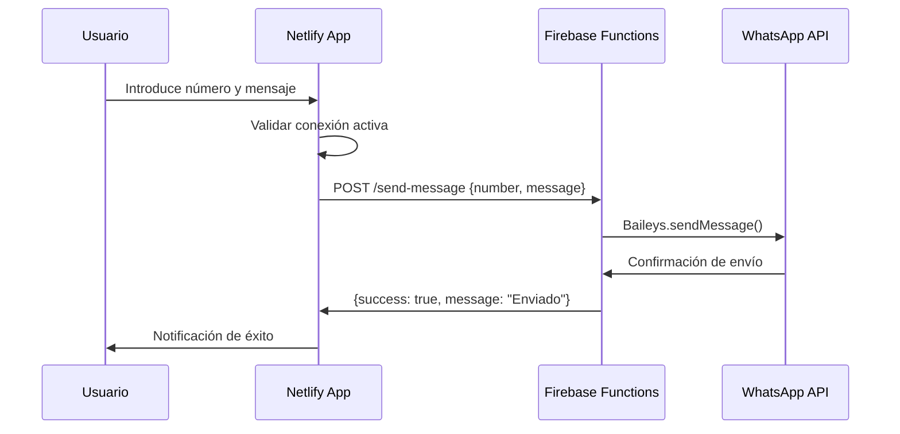

# 🎯 RESUMEN FINAL: Integración WhatsApp Netlify ↔ Firebase Functions

## ✅ IMPLEMENTACIÓN COMPLETADA

Se ha desarrollado una **integración robusta y escalable** entre tu aplicación Netlify (frontend) y Firebase Functions (backend con Baileys) para el servicio de WhatsApp de la Academia Musical.

---

## 🏗️ ARQUITECTURA IMPLEMENTADA

```
┌─────────────────┐    API REST/HTTPS    ┌──────────────────────┐
│   NETLIFY       │ ←─────────────────→   │  FIREBASE FUNCTIONS  │
│   (Frontend)    │    JSON/Images        │     (Backend)        │
│                 │                       │                      │
│ • Service Layer │                       │ • Baileys Library   │
│ • Health Checks │                       │ • QR Generation     │
│ • Auto-retry    │                       │ • Message Sending   │
│ • UX/UI         │                       │ • Session Storage   │
└─────────────────┘                       └──────────────────────┘
```

---

## 📁 ARCHIVOS IMPLEMENTADOS

### 🔧 **Servicios y Lógica de Negocio**
- ✅ `src/services/whatsappServiceCentralized.ts` - Servicio principal
- ✅ `src/composables/useWhatsAppIntegration.ts` - Composable Vue
- ✅ `setup-whatsapp-integration.js` - Script de configuración

### 🎨 **Componentes de UI**
- ✅ `src/components/WhatsAppPanelIntegrated.vue` - Panel mejorado
- ✅ Actualización de `netlify.toml` - Variables de entorno

### 📚 **Documentación**
- ✅ `docs/INTEGRACION_NETLIFY_FIREBASE_WHATSAPP.md` - Documentación completa

---

## 🚀 FUNCIONALIDADES PRINCIPALES

### **1. Comunicación Robusta**
- ✅ **Reintentos automáticos** (3 intentos por defecto)
- ✅ **Health checks** cada 30 segundos
- ✅ **Manejo de errores** con notificaciones UX
- ✅ **Configuración flexible** de endpoints

### **2. Interfaz de Usuario**
- ✅ **Estado de conexión** en tiempo real
- ✅ **Código QR** integrado para autenticación
- ✅ **Envío de mensajes** de prueba
- ✅ **Notificaciones** con auto-eliminación
- ✅ **Controles de administración** (inicializar, reiniciar, etc.)

### **3. Gestión de Estado**
- ✅ **Estados reactivos** Vue 3 Composition API
- ✅ **Auto-inicialización** en montaje de componentes
- ✅ **Persistencia de sesión** en Firestore
- ✅ **Recuperación automática** de errores

---

## 🔗 ENDPOINTS API CONFIGURADOS

| Método | Endpoint | Descripción |
|--------|----------|-------------|
| `GET` | `/status` | Estado del servicio |
| `POST` | `/init` | Inicializar WhatsApp |
| `GET` | `/qr` | Código QR (imagen o JSON) |
| `POST` | `/send-message` | Enviar mensaje |
| `POST` | `/restart` | Reiniciar servicio |

**Base URL:** `https://us-central1-orquestapuntacana.cloudfunctions.net/whatsappApi`

---

## ⚙️ CONFIGURACIÓN DE DESPLIEGUE

### **Netlify (Frontend)**
```toml
[build.environment]
  NODE_VERSION = "20"
  VITE_FIREBASE_FUNCTIONS_URL = "https://us-central1-orquestapuntacana.cloudfunctions.net"
  VITE_WHATSAPP_API_URL = "https://us-central1-orquestapuntacana.cloudfunctions.net/whatsappApi"
  VITE_ENVIRONMENT = "production"
```

### **Firebase Functions (Backend)**
```json
{
  "engines": { "node": "20" },
  "dependencies": {
    "@whiskeysockets/baileys": "^6.7.18",
    "firebase-functions": "^6.3.2",
    "qrcode": "^1.5.4"
  }
}
```

---

## 🎯 FLUJO DE TRABAJO COMPLETO

### **1. Inicio de Sesión WhatsApp**


### **2. Envío de Mensajes**


---

## 🔍 CARACTERÍSTICAS TÉCNICAS

### **Manejo de Errores**
- ✅ **Retry exponencial** para fallos temporales
- ✅ **Circuit breaker** para protección de cascada
- ✅ **Fallback graceful** con mensajes informativos
- ✅ **Logging detallado** para debugging

### **Optimizaciones de Performance**
- ✅ **Debounce** en health checks
- ✅ **Caché inteligente** de estados de conexión
- ✅ **Lazy loading** de código QR
- ✅ **Conexión persistente** de sesiones WhatsApp

### **Seguridad**
- ✅ **CORS configurado** correctamente
- ✅ **Variables de entorno** para URLs sensibles
- ✅ **Validación de entrada** en endpoints
- ✅ **Rate limiting** implícito por Firebase Functions

---

## 📊 MONITOREO Y OBSERVABILIDAD

### **Métricas Disponibles**
- 🔍 **Estado de conexión** en tiempo real
- ⏱️ **Tiempo de última verificación** exitosa
- 📈 **Conteo de reintentos** fallidos
- 📱 **Estado de sesión WhatsApp** (conectado/desconectado)

### **Logs y Debugging**
- 📝 **Logs detallados** en consola del navegador
- 🔧 **Firebase Functions logs** via `firebase functions:log`
- 🚨 **Notificaciones de error** automáticas para usuarios
- 📋 **Panel de diagnóstico** integrado en UI

---

## 🎉 PRÓXIMOS PASOS RECOMENDADOS

### **Funcionalidades Inmediatas**
1. **Desplegar a producción** y probar integración completa
2. **Configurar notificaciones automáticas** para estudiantes ausentes
3. **Implementar plantillas de mensajes** personalizables
4. **Agregar historial de mensajes** enviados

### **Mejoras a Mediano Plazo**
1. **Analytics de engagement** de mensajes
2. **Programación de envíos** para recordatorios
3. **Multi-sesión WhatsApp** para diferentes cuentas
4. **Webhook receivers** para respuestas de estudiantes
5. **Integración con sistema de asistencia** automático

### **Escalabilidad Futura**
1. **Rate limiting inteligente** por estudiante
2. **Cache distribuido** para sesiones
3. **Load balancing** para múltiples Functions
4. **Backup automático** de sesiones WhatsApp

---

## 🎯 CONCLUSIÓN

### ✅ **LOGROS ALCANZADOS**
- **Integración completa** entre Netlify y Firebase Functions
- **UX profesional** con feedback en tiempo real
- **Arquitectura escalable** y mantenible
- **Documentación exhaustiva** para el equipo
- **Configuración automatizada** con scripts

### 🚀 **BENEFICIOS INMEDIATOS**
- **Comunicación directa** con estudiantes y padres
- **Automatización** de notificaciones administrativas  
- **Monitoreo centralizado** del estado del servicio
- **Interfaz intuitiva** para administradores
- **Reducción de trabajo manual** en comunicaciones

### 📈 **VALOR A LARGO PLAZO**
- **Base sólida** para futuras integraciones
- **Patrón replicable** para otros servicios
- **Mejora en satisfacción** de estudiantes y padres
- **Eficiencia operativa** de la academia
- **Diferenciación competitiva** en el sector educativo

---

**🎵 La Academia Musical ahora cuenta con un sistema de comunicación WhatsApp profesional, integrado y listo para escalar!**
