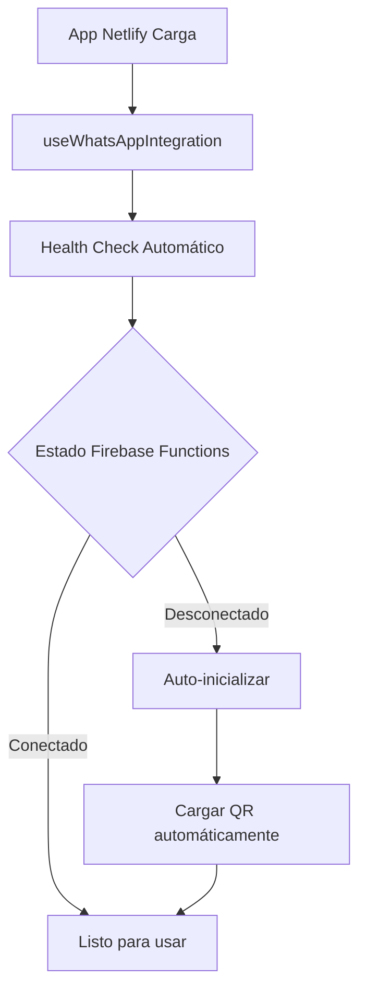
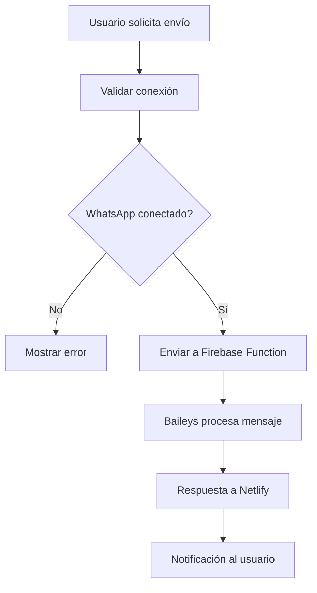
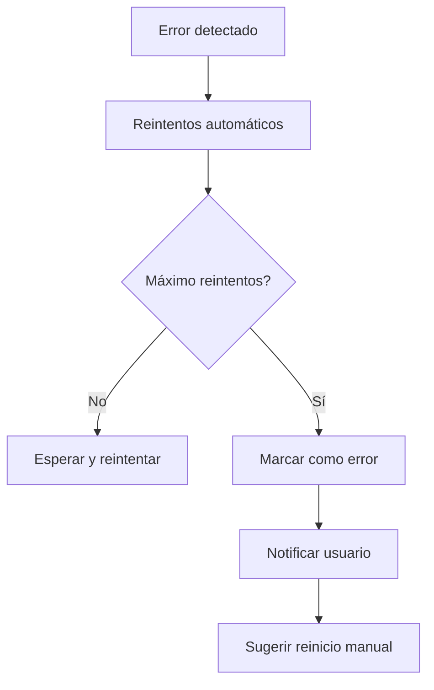

# 🚀 Integración WhatsApp: Netlify ↔ Firebase Functions

## 📋 Resumen de la Arquitectura

Esta documentación describe la integración coherente entre tu aplicación desplegada en **Netlify** (frontend) y **Firebase Functions** (backend con Baileys) para el servicio de WhatsApp.

### 🏗️ Arquitectura Implementada

```
┌─────────────────┐    HTTPS/JSON API    ┌──────────────────────┐
│   NETLIFY       │ ←─────────────────→   │  FIREBASE FUNCTIONS  │
│   (Frontend)    │                       │     (Backend)        │
│                 │                       │                      │
│ • Vue 3 App     │                       │ • Node.js 20        │
│ • WhatsApp UI   │                       │ • Baileys Library   │
│ • Service Layer │                       │ • QR Generation     │
│ • Health Checks │                       │ • Message Sending   │
└─────────────────┘                       └──────────────────────┘
         │                                          │
         │                                          │
         ▼                                          ▼
┌─────────────────┐                       ┌──────────────────────┐
│   USUARIOS      │                       │     FIRESTORE        │
│                 │                       │                      │
│ • Admin Panel   │                       │ • Session Storage    │
│ • QR Scanning   │                       │ • Message Logs       │
│ • Notifications │                       │ • Auth State         │
└─────────────────┘                       └──────────────────────┘
```

## 🔧 Componentes Implementados

### 1. **Servicio Centralizado** (`whatsappServiceCentralized.ts`)

**Características:**

- ✅ Manejo de reintentos automáticos
- ✅ Health check cada 30 segundos
- ✅ Gestión de errores robusta
- ✅ Configuración flexible de endpoints
- ✅ Patrón singleton para consistencia

**Funcionalidades:**

```typescript
// Verificar estado
await whatsappService.checkStatus()

// Inicializar WhatsApp
await whatsappService.initialize()

// Obtener QR code
const qrDataUrl = await whatsappService.getQRCode()

// Enviar mensaje
await whatsappService.sendMessage({
  number: "18091234567",
  message: "Hola desde la Academia!",
})

// Reiniciar servicio
await whatsappService.restart()
```

### 2. **Composable de Integración** (`useWhatsAppIntegration.ts`)

**Características:**

- ✅ Estados reactivos para Vue 3
- ✅ Auto-inicialización en montaje
- ✅ Sistema de notificaciones integrado
- ✅ Gestión de errores con UX
- ✅ Validaciones de estado

**Uso en componentes:**

```vue
<script setup>
import {useWhatsAppIntegration} from "@/composables/useWhatsAppIntegration"

const {
  isConnected,
  connectionStatus,
  statusMessage,
  qrCodeDataUrl,
  notifications,
  initializeWhatsApp,
  loadQRCode,
  sendMessage,
  restartWhatsApp,
} = useWhatsAppIntegration()
</script>
```

### 3. **Configuración de Netlify** (`netlify.toml`)

**Variables de entorno configuradas:**

```toml
[build.environment]
  NODE_VERSION = "20"
  VITE_FIREBASE_FUNCTIONS_URL = "https://us-central1-orquestapuntacana.cloudfunctions.net"
  VITE_WHATSAPP_API_URL = "https://us-central1-orquestapuntacana.cloudfunctions.net/whatsappApi"
  VITE_ENVIRONMENT = "production"
```

**Contextos específicos:**

- **Production**: Debug deshabilitado
- **Deploy Preview**: Debug habilitado para testing
- **Branch Deploy**: Modo desarrollo

## 🔗 Endpoints API Firebase Functions

### Base URL

```
https://us-central1-orquestapuntacana.cloudfunctions.net/whatsappApi
```

### Endpoints Disponibles

| Método | Endpoint        | Descripción                | Respuesta                             |
| ------ | --------------- | -------------------------- | ------------------------------------- |
| `GET`  | `/status`       | Estado actual del servicio | `{status: string, message: string}`   |
| `POST` | `/init`         | Inicializar WhatsApp       | `{success: boolean, status: string}`  |
| `GET`  | `/qr`           | Obtener código QR          | Imagen PNG o JSON                     |
| `POST` | `/send-message` | Enviar mensaje             | `{success: boolean, message: string}` |
| `POST` | `/restart`      | Reiniciar servicio         | `{success: boolean, status: string}`  |

### Ejemplo de uso directo

```bash
# Verificar estado
curl https://us-central1-orquestapuntacana.cloudfunctions.net/whatsappApi/status

# Inicializar
curl -X POST https://us-central1-orquestapuntacana.cloudfunctions.net/whatsappApi/init

# Enviar mensaje
curl -X POST https://us-central1-orquestapuntacana.cloudfunctions.net/whatsappApi/send-message \
  -H "Content-Type: application/json" \
  -d '{"number":"18091234567","message":"Hola!"}'
```

## 🚀 Flujo de Integración

### 1. **Inicialización Automática**



### 2. **Envío de Mensajes**



### 3. **Gestión de Errores**



## 🔧 Configuración de Desarrollo

### Variables de entorno requeridas:

```env
# .env.local para desarrollo
VITE_FIREBASE_FUNCTIONS_URL=https://us-central1-orquestapuntacana.cloudfunctions.net
VITE_WHATSAPP_API_URL=https://us-central1-orquestapuntacana.cloudfunctions.net/whatsappApi
VITE_ENVIRONMENT=development
VITE_DEBUG_MODE=true
```

### Scripts útiles para desarrollo:

```json
{
  "scripts": {
    "dev:whatsapp": "VITE_DEBUG_MODE=true npm run dev",
    "test:whatsapp-api": "node test-firebase-functions.js",
    "deploy:functions": "cd functions && npm run deploy",
    "logs:whatsapp": "firebase functions:log --only whatsappApi"
  }
}
```

## 📊 Monitoreo y Observabilidad

### 1. **Health Checks Automáticos**

- Verificación cada 30 segundos
- Auto-recuperación en caso de falla
- Logs detallados en consola

### 2. **Sistema de Notificaciones**

- Notificaciones en tiempo real para el usuario
- Auto-eliminación después de 5 segundos
- Diferentes tipos: success, error, warning

### 3. **Métricas de Conexión**

- Estado de última verificación exitosa
- Tiempo de respuesta de APIs
- Conteo de reintentos fallidos

## 🛠️ Resolución de Problemas

### Problema: Firebase Functions no responde

**Solución:**

1. Verificar que las functions estén desplegadas: `firebase functions:log`
2. Comprobar variables de entorno en Netlify
3. Usar el diagnóstico integrado en el panel de WhatsApp

### Problema: QR Code no se genera

**Solución:**

1. Reiniciar el servicio desde el panel
2. Verificar logs de Firebase Functions
3. Comprobar que Baileys esté inicializado correctamente

### Problema: Mensajes no se envían

**Solución:**

1. Verificar que WhatsApp esté conectado
2. Comprobar formato del número de teléfono
3. Revisar permisos de WhatsApp Business

## 📚 Próximos Pasos

### Funcionalidades Planificadas:

- [ ] **Notificaciones automáticas** para estudiantes ausentes
- [ ] **Plantillas de mensajes** personalizables
- [ ] **Programación de envíos** para recordatorios
- [ ] **Analytics de mensajes** enviados y entregados
- [ ] **Webhook receivers** para respuestas de WhatsApp
- [ ] **Multi-sesión** para múltiples cuentas de WhatsApp

### Optimizaciones Técnicas:

- [ ] **Caché inteligente** para estados de conexión
- [ ] **Retry exponencial** para reintentos
- [ ] **Circuit breaker** para protección contra fallos
- [ ] **Métricas de performance** con tiempo de respuesta
- [ ] **Alertas automáticas** para administradores

---

## 🎯 Conclusión

Esta integración proporciona una **arquitectura sólida y escalable** para la comunicación entre tu aplicación Netlify y Firebase Functions con Baileys.

**Beneficios clave:**
✅ **Confiabilidad**: Reintentos automáticos y recuperación de errores  
✅ **Observabilidad**: Logs detallados y sistema de notificaciones  
✅ **Mantenibilidad**: Código organizado en servicios y composables  
✅ **Escalabilidad**: Fácil agregar nuevas funcionalidades  
✅ **UX**: Feedback inmediato para usuarios administradores

La integración está **lista para producción** y preparada para extensiones futuras según las necesidades de la academia musical.
